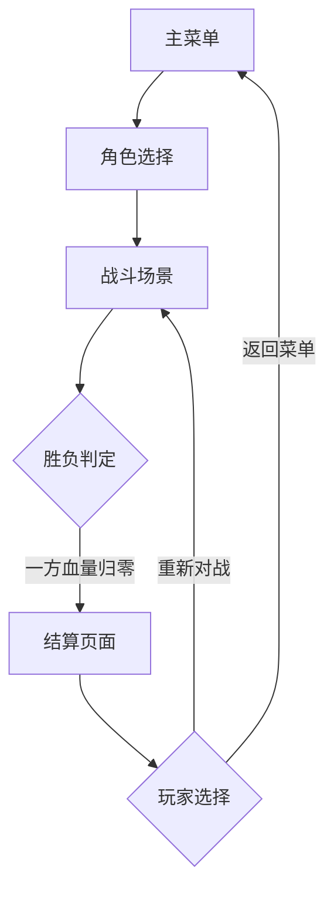
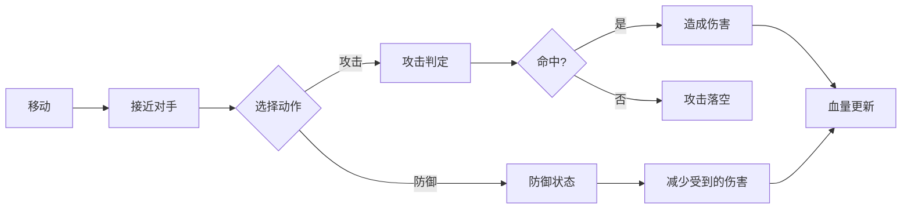

# 机甲对战小游戏 - 产品需求文档

## 1. 产品概述

一款复古像素风格的双人对战机甲游戏，支持本地双人对战，玩家各自操控机甲进行战斗，通过移动、攻击、防御等操作击败对手。游戏采用经典街机风格，适合微信小程序H5平台运行。

- **目标用户**: 喜欢像素风格、怀旧街机游戏的休闲玩家
- **核心价值**: 提供简单易上手但富有策略性的对战体验，重温经典街机游戏乐趣

## 2. 核心功能

### 2.1 游戏角色

| 角色 | 特点 | 技能 |
|------|------|------|
| 机甲战士A | 均衡型，中等攻击力和速度 | 冲刺攻击、能量护盾 |
| 机甲战士B | 重装型，高攻击低速度 | 重击、铁壁防御 |

### 2.2 功能模块

1. **主菜单页面**: 游戏标题、开始游戏、角色选择、操作说明
2. **角色选择页面**: 两个机甲角色展示与选择
3. **战斗场景**: 主游戏界面，包含双方机甲、血量条、战斗区域
4. **结算页面**: 胜负结果展示、重新开始、返回菜单

### 2.3 页面详情

| 页面名称 | 模块名称 | 功能描述 |
|----------|----------|----------|
| 主菜单 | 游戏标题 | 像素风格游戏LOGO动画展示 |
| 主菜单 | 开始按钮 | 点击进入角色选择 |
| 主菜单 | 操作说明 | 展示双方控制键位 |
| 角色选择 | 角色展示 | 两个机甲的像素立绘和属性介绍 |
| 角色选择 | 确认选择 | 选择后进入战斗 |
| 战斗场景 | 战斗区域 | 16bit像素风格的竞技场背景 |
| 战斗场景 | 血量条 | 双方血量显示，受伤时闪烁 |
| 战斗场景 | 机甲动画 | 待机、移动、攻击、防御、受伤动画 |
| 战斗场景 | 特效系统 | 攻击命中特效、防御火花、胜利姿势 |
| 结算页面 | 胜负展示 | 胜利方机甲姿势、失败方倒地 |
| 结算页面 | 操作按钮 | 重新对战、返回菜单 |

## 3. 核心流程

### 3.1 游戏流程描述

1. 玩家打开游戏，进入主菜单
2. 点击"开始游戏"进入角色选择界面
3. 双方玩家各选择一个机甲角色
4. 进入战斗场景，倒计时后开始对战
5. 双方通过键盘操控机甲进行战斗
6. 当一方血量归零时，战斗结束
7. 显示结算页面，可选择重新对战或返回菜单

### 3.2 流程图

### 3.3 战斗操作流程

## 4. 用户界面设计

### 4.1 设计风格

- **主色调**: 深蓝(#1a1a2e) + 霓虹青(#00fff5) + 霓虹粉(#ff006e)
- **辅助色**: 金属灰(#4a4a6a)、能量黄(#ffd700)
- **按钮风格**: 像素边框按钮，带霓虹发光效果
- **字体**: 像素字体(Press Start 2P / Zpix)
- **布局风格**: 居中对称布局，战斗场景为横版卷轴视角
- **图标风格**: 8bit像素图标，带简单动画

### 4.2 页面设计概览

| 页面名称 | 模块名称 | UI元素 |
|----------|----------|--------|
| 主菜单 | 游戏标题 | 大号像素字体，霓虹发光效果，轻微浮动动画 |
| 主菜单 | 开始按钮 | 居中放置，悬停时放大闪烁 |
| 主菜单 | 操作说明 | 底部半透明面板，显示键位图示 |
| 角色选择 | 角色卡片 | 左右对称布局，像素立绘+属性条 |
| 角色选择 | 选择指示 | P1/P2标识，选中高亮边框 |
| 战斗场景 | 背景 | 像素城市废墟风格，带远景和中景层次 |
| 战斗场景 | 血量条 | 顶部左右对称，像素风格血条 |
| 战斗场景 | 机甲 | 32x48像素精灵，多帧动画 |
| 战斗场景 | 特效 | 命中闪光、能量波纹、火花粒子 |
| 结算页面 | 胜利展示 | 胜利方机甲胜利姿势，彩色纸屑 |
| 结算页面 | 按钮 | 像素风格按钮，带音效反馈 |

### 4.3 响应式设计

- **桌面优先**: 主要针对桌面浏览器设计
- **移动适配**: 战斗场景支持触摸虚拟按键
- **微信小程序**: 适配小程序webview全屏显示

### 4.4 操作方式

**玩家1 (键盘左侧)**:
- 移动: A/D (左右移动)
- 跳跃: W
- 攻击: F
- 防御: G

**玩家2 (键盘右侧)**:
- 移动: 方向键 左/右
- 跳跃: 方向键 上
- 攻击: L
- 防御: K

## 5. 游戏机制

### 5.1 基础属性

| 属性 | 机甲A | 机甲B |
|------|-------|-------|
| 血量 | 100 | 120 |
| 攻击力 | 15 | 20 |
| 移动速度 | 中等 | 较慢 |
| 攻击范围 | 中等 | 较大 |
| 防御减伤 | 50% | 60% |

### 5.2 战斗机制

- **普通攻击**: 近战攻击，命中造成全额伤害
- **防御状态**: 按住防御键进入防御，减少受到的伤害
- **硬直时间**: 攻击后短暂无法行动，防御可被打断
- **击退效果**: 被攻击时轻微后退
- **无敌帧**: 受伤后短暂无敌，防止连续受伤

### 5.3 胜负判定

- 一方血量归零即判负
- 可扩展：限时模式，时间结束时血量多者胜

## 6. 素材方案

### 6.1 像素素材清单

| 素材类型 | 数量 | 规格 | 来源方案 |
|----------|------|------|----------|
| 机甲精灵 | 2套 | 32x48px | CSS像素绘制 / Canvas绘制 |
| 动画帧 | 10帧/角色 | 32x48px | 程序生成 |
| 背景图层 | 3层 | 800x400px | CSS渐变+像素元素 |
| UI元素 | 10+ | 各异 | CSS像素风格 |
| 特效粒子 | 5种 | 8x8px | Canvas绘制 |

### 6.2 动画列表

| 动画名称 | 帧数 | 描述 |
|----------|------|------|
| 待机 | 4帧 | 轻微呼吸动画 |
| 移动 | 6帧 | 腿部行走动画 |
| 攻击 | 4帧 | 挥拳/挥剑动作 |
| 防御 | 2帧 | 护盾展开 |
| 受伤 | 2帧 | 后仰闪烁 |
| 胜利 | 4帧 | 举起武器庆祝 |
| 失败 | 4帧 | 倒地动画 |

### 6.3 音效方案 (可选扩展)

- 背景音乐: 8bit电子风格
- 攻击音效: 像素打击音
- 命中音效: 金属碰撞
- 胜利音效: 经典胜利旋律
