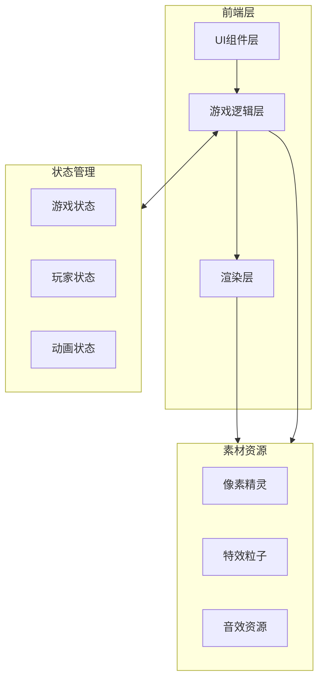
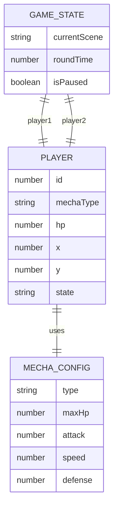
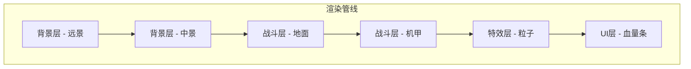

# 机甲对战小游戏 - 技术架构文档

## 1. 架构设计



## 2. 技术说明

- **前端框架**: React 18 + TypeScript
- **样式方案**: Tailwind CSS 3 + CSS像素动画
- **构建工具**: Vite
- **游戏渲染**: Canvas 2D API
- **状态管理**: React useState + useReducer
- **动画系统**: requestAnimationFrame + 帧动画
- **后端服务**: 无 (纯前端游戏)
- **数据存储**: localStorage (游戏设置/最高分)

## 3. 路由定义

| 路由 | 用途 |
|------|------|
| / | 主菜单页面 |
| /select | 角色选择页面 |
| /battle | 战斗场景页面 |
| /result | 结算页面 |

## 4. 核心模块设计

### 4.1 游戏引擎模块

```typescript
interface GameEngine {
  canvas: HTMLCanvasElement;
  ctx: CanvasRenderingContext2D;
  gameLoop: () => void;
  deltaTime: number;
  lastTime: number;
}

interface GameScene {
  enter(): void;
  update(deltaTime: number): void;
  render(ctx: CanvasRenderingContext2D): void;
  exit(): void;
}
```

### 4.2 机甲实体模块

```typescript
interface Mecha {
  id: 'A' | 'B';
  name: string;
  hp: number;
  maxHp: number;
  attack: number;
  speed: number;
  defense: number;
  x: number;
  y: number;
  velocityX: number;
  velocityY: number;
  facing: 'left' | 'right';
  state: MechaState;
  isGrounded: boolean;
  invincibleTime: number;
  attackCooldown: number;
}

type MechaState = 
  | 'idle'
  | 'walk'
  | 'jump'
  | 'attack'
  | 'defend'
  | 'hurt'
  | 'victory'
  | 'defeat';

interface MechaConfig {
  maxHp: number;
  attack: number;
  speed: number;
  defense: number;
  attackRange: number;
}
```

### 4.3 输入控制模块

```typescript
interface InputManager {
  keys: Set<string>;
  player1Keys: PlayerKeys;
  player2Keys: PlayerKeys;
  isKeyPressed(player: 1 | 2, action: ActionKey): boolean;
  isKeyJustPressed(player: 1 | 2, action: ActionKey): boolean;
}

interface PlayerKeys {
  left: string;
  right: string;
  jump: string;
  attack: string;
  defend: string;
}

type ActionKey = 'left' | 'right' | 'jump' | 'attack' | 'defend';
```

### 4.4 碰撞检测模块

```typescript
interface Hitbox {
  x: number;
  y: number;
  width: number;
  height: number;
}

interface CollisionResult {
  hit: boolean;
  damage: number;
  knockback: number;
}

function checkAttackCollision(
  attacker: Mecha,
  defender: Mecha
): CollisionResult;
```

### 4.5 动画系统模块

```typescript
interface Animation {
  frames: number;
  frameDuration: number;
  loop: boolean;
}

interface SpriteSheet {
  idle: Animation;
  walk: Animation;
  jump: Animation;
  attack: Animation;
  defend: Animation;
  hurt: Animation;
  victory: Animation;
  defeat: Animation;
}
```

## 5. 数据模型

### 5.1 游戏状态模型



### 5.2 游戏配置数据

```typescript
const MECHA_CONFIGS: Record<'A' | 'B', MechaConfig> = {
  A: {
    maxHp: 100,
    attack: 15,
    speed: 5,
    defense: 0.5,
    attackRange: 60,
  },
  B: {
    maxHp: 120,
    attack: 20,
    speed: 3,
    defense: 0.6,
    attackRange: 80,
  },
};

const GAME_CONFIG = {
  gravity: 0.8,
  groundY: 320,
  stageWidth: 800,
  stageHeight: 400,
  invincibleDuration: 500,
  attackCooldown: 400,
  knockbackForce: 8,
};
```

## 6. 渲染架构

### 6.1 渲染层次



### 6.2 像素绘制方案

使用Canvas 2D API绘制像素图形:

```typescript
function drawPixelMecha(
  ctx: CanvasRenderingContext2D,
  mecha: Mecha,
  frame: number
): void {
  const pixels = MECHA_SPRITES[mecha.id][mecha.state];
  const frameData = pixels[frame % pixels.length];
  
  ctx.save();
  ctx.translate(mecha.x, mecha.y);
  if (mecha.facing === 'left') {
    ctx.scale(-1, 1);
  }
  
  frameData.forEach((row, y) => {
    row.forEach((color, x) => {
      if (color) {
        ctx.fillStyle = color;
        ctx.fillRect(x * 2, y * 2, 2, 2);
      }
    });
  });
  
  ctx.restore();
}
```

## 7. 文件结构

```
src/
├── components/
│   ├── Menu/
│   │   ├── MainMenu.tsx
│   │   ├── CharacterSelect.tsx
│   │   └── ResultScreen.tsx
│   ├── Battle/
│   │   ├── BattleCanvas.tsx
│   │   ├── HealthBar.tsx
│   │   └── Controls.tsx
│   └── UI/
│       ├── PixelButton.tsx
│       └── PixelText.tsx
├── game/
│   ├── engine/
│   │   ├── GameLoop.ts
│   │   └── SceneManager.ts
│   ├── entities/
│   │   ├── Mecha.ts
│   │   └── Projectile.ts
│   ├── systems/
│   │   ├── InputSystem.ts
│   │   ├── CollisionSystem.ts
│   │   └── AnimationSystem.ts
│   └── config/
│       ├── MechaConfig.ts
│       └── GameConfig.ts
├── sprites/
│   ├── MechaA.ts
│   ├── MechaB.ts
│   └── Effects.ts
├── hooks/
│   ├── useGameLoop.ts
│   └── useInput.ts
├── types/
│   └── game.ts
├── App.tsx
└── main.tsx
```

## 8. 性能优化

### 8.1 渲染优化

- 使用 `requestAnimationFrame` 进行帧同步
- 离屏Canvas预渲染静态背景
- 对象池管理特效粒子
- 状态变化时才重绘UI层

### 8.2 内存优化

- 精灵数据使用常量定义，避免重复创建
- 动画帧数据预加载
- 事件监听器正确清理

## 9. 微信小程序适配

### 9.1 WebView适配要点

- 使用 `window.innerWidth/innerHeight` 获取视口尺寸
- 禁用页面滚动和缩放
- 触摸事件转换为虚拟按键输入
- 适配安全区域

### 9.2 触摸控制方案

```typescript
interface TouchControls {
  leftButton: { x: number; y: number; radius: number };
  rightButton: { x: number; y: number; radius: number };
  attackButton: { x: number; y: number; radius: number };
  defendButton: { x: number; y: number; radius: number };
  jumpButton: { x: number; y: number; radius: number };
}
```

## 10. 扩展性设计

### 10.1 可扩展功能

- 新增机甲角色: 只需添加配置和精灵数据
- 新增技能系统: 扩展MechaState和输入映射
- 新增游戏模式: 基于Scene接口实现新场景
- 新增网络对战: 抽象输入层，支持远程输入
